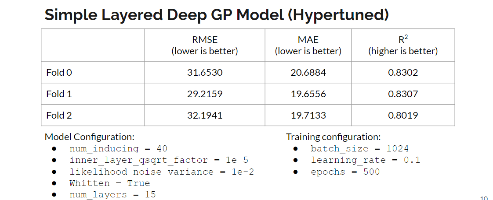
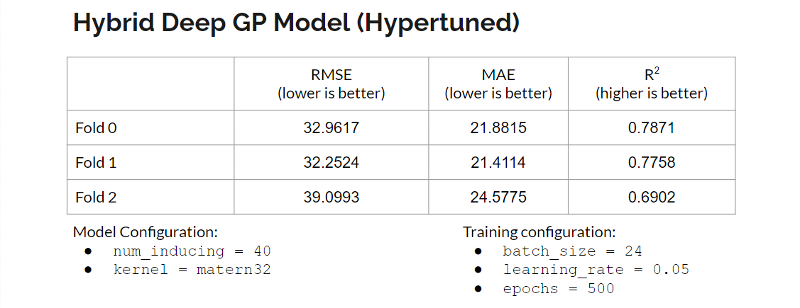
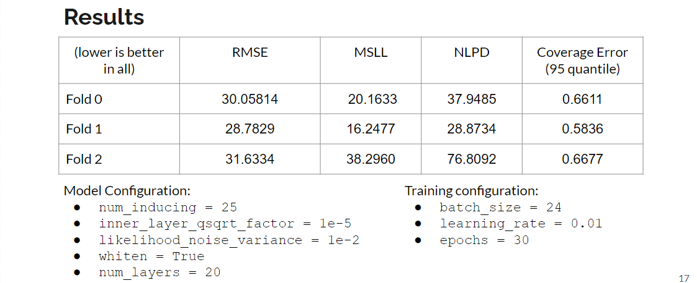

# DeepGP-AQ-Inference

## To Run:
For any deep gaussian approach, open the respective folder. Add appropriate hyper-parameters to `run.py` script.

```bash
python run.py
```

The test results would be stored in the respective folders `results.jl` file.


## Results:
1. Simple Layered Deep GP Model
    

2. Hybrid Deep GP Model
    

3. Doubly Stochastic Variational Inference Model
    